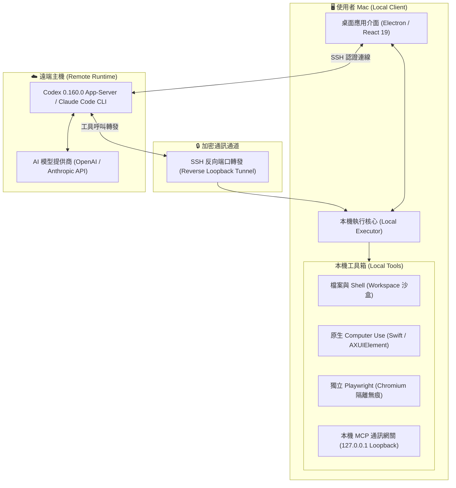

# AgentBridge Studio

[繁體中文](README.md) · [English](README_EN.md)

在 Mac 上與 Codex、Claude Code 對話，讓 Agent 處理**這台 Mac** 的檔案、命令、應用程式與網頁。模型 Runtime 與登入保留在你選擇的遠端主機，工作工具在本機執行。

**版本 0.4.7 · Apple Silicon · macOS 13 或更新版本**

> 這是遠端 Runtime 用戶端。安裝後不用另外下載 Node.js、Python、Homebrew、Codex Mac 執行器、Computer Use MCP 或瀏覽器；第一次使用仍須填入可連線、已登入的遠端 Runtime，並授予 macOS 所需權限。它不包含免費 AI 帳號或離線模型。

## 🏗️ 架構與實現原理 (Architecture & How It Works)

AgentBridge Studio 採用 **「大腦與手腳分離 (Split-Execution)」** 的雙端解耦設計：**遠端主機負責 AI 模型推理與對話上下文，本機 Mac 負責安全執行真實世界工具與系統操作**。



### 核心實現原理

1. **遠端推理，憑證不落地 (Remote Runtime & Credential Isolation)**
   * AI 模型的登入態、ChatGPT 帳號憑證、Anthropic API Key 與對話歷史完整保留在你的遠端工作站或伺服器。
   * Mac 本機無需儲存任何雲端 API Key，遠端主機離線或斷開時本機絕無憑證殘留風險。
   * 本機僅透過 macOS Keychain 支援的加密機制儲存連線用的 SSH 憑證。

2. **安全反向隧道 (Reverse Loopback Tunneling)**
   * App 透過安全的 SSH 連線與遠端主機握手，並驗證主機公鑰指紋以防止中間人攻擊 (MITM)。
   * 透過 SSH 反向連接埠轉發 (Reverse TCP Forwarding) 將遠端工具請求安全回傳至本機。
   * 本機端點嚴格限制於 `127.0.0.1` 迴路，阻止任何來自外網或未授權局域網的非法存取。

3. **零依賴全內建模組 (Self-Contained Native Subsystems)**
   * **原生 Computer Use**：以 Swift 語言開發，直接透過 macOS Accessibility APIs (`AXUIElement`) 與 Quartz 顯示服務截取螢幕與模擬事件，並具有即時畫面覆蓋游標 (Overlay Cursor)，效能極致且不依賴外部 Python/Node 套件。
   * **隔離式瀏覽器引擎**：內建 Playwright 專用 Chromium 與 FFmpeg，具備獨立 User Data Profile，不讀取、不污染使用者日常 Chrome/Safari 的 Cookies 與隱私資料。
   * **路徑嚴格校驗**：本機工作目錄具備防路徑穿越 (Path Traversal) 與符號連結限制，防止危險的系統根目錄竄改。

4. **系統級權限邊界 (Operating System Permission Boundary)**
   * App 內的「最高權限」模式僅控制是否彈出重複確認對話框，無法繞過 macOS 系統層級的「輔助使用」與「螢幕錄製」隱私安全防護，嚴格遵循 Apple 系統安全模型。

## 快速開始 (Quick Start)

你可以選擇直接下載打包好的 DMG 執行，或透過 Git Clone 從原始碼直接執行。

### 方式一：Git Clone 直接在任何電腦執行（推薦開發者）

複製專案並執行內建的一鍵啟動腳本：

```sh
git clone https://github.com/iancheng64-cmd/AgentBridgeStudio.git
cd AgentBridgeStudio
./start.sh
```

或使用 npm：

```sh
git clone https://github.com/iancheng64-cmd/AgentBridgeStudio.git
cd AgentBridgeStudio
npm install
npm start
```

> **說明**：`./start.sh` 與 `npm start` 會自動檢測環境、安裝依賴、編譯 TypeScript/Vite，並配置 Playwright 瀏覽器運行環境，即使初次 Clone 也能一鍵完整啟動。
> 若需使用原生 macOS Computer Use（滑鼠點擊/畫面辨識），請確保系統已安裝 Xcode Command Line Tools（執行 `xcode-select --install`）。

### 方式二：下載打包好的 DMG 安裝檔（免編譯）

到這個儲存庫的 **[Releases](https://github.com/iancheng64-cmd/AgentBridgeStudio/releases)** 頁，下載最新版 `AgentBridge-Studio-0.4.7-arm64.dmg`。

1. 打開 DMG，將 **AgentBridge Studio** 拖到 **Applications**。
2. 從「應用程式」開啟 App；不要直接在 DMG 中執行。
3. **若 macOS 出現安全性提示（無法打開／已損毀）**，可於終端機執行解除隔離：
   ```sh
   xattr -cr "/Applications/AgentBridge Studio.app"
   ```
   或前往「系統設定 → 隱私權與安全性」點選「仍要打開」。
4. 到「設定 → 連線與 Agent」，新增遠端設備、填入 SSH 資訊，選擇 Codex 或 Claude Code。
5. 選擇這台 Mac 的工作資料夾，連接 Runtime。首次連線需核對 SSH 主機指紋。
6. 如需看螢幕、點擊或輸入，到「電腦與工具」請求並檢查「輔助使用」及「螢幕錄製」權限。

詳細步驟及故障排除：[安裝指南](docs/INSTALLATION.md)。

## 安裝檔包含什麼

| 元件 | 是否內建 |
| --- | --- |
| 桌面 App、Electron 與 Node 執行環境 | 是 |
| Mac Codex CLI／配對執行器 0.160.0 | 是 |
| 原生 Computer Use、CLI 與畫面 overlay helper | 是 |
| Playwright MCP 與版本配對的瀏覽器、FFmpeg | 是 |
| MCP 通訊與 HTTP gateway | 是 |
| 遠端 Runtime 的帳號／憑證、AI 模型 | 否，由使用者選定的 Runtime 與服務提供 |

第一次啟動不會安裝套件或下載瀏覽器。**瀏覽器工具使用 App 內的獨立瀏覽器**，不沿用你日常 Chrome 的登入狀態；網站登入需在該瀏覽器中完成。

內建 Computer Use 是新安裝的預設來源。原本已安裝 Open Computer Use 的使用者仍可明確選用外部來源；新使用者不需要安裝它。

## 遠端主機條件

- 可由 Mac 存取的 SSH 服務及正確登入資訊。可用區域網路、既有 VPN 或其他安全 SSH 連線方式；一般 Runtime 連線不強制安裝 Tailscale。
- Codex：主機已安裝並登入 **Codex 0.160.0**，與 App 內建執行器配對。其他版本不保證 Mac 工具可用。
- Claude：主機已安裝可使用的原生 Claude Code CLI 與 Node.js 通訊橋，並完成帳號登入或 API provider 設定。
- 該主機必須保持開機且可連線；主機離線時無法執行 AI 工作。

這些是遠端設備的前提，DMG 無法替另一台電腦自動安裝或授權。SSH 密碼在 App 輸入，選擇記住時由 macOS Keychain 支援的加密儲存；遠端模型登入憑證不複製到 Mac。

## 功能

- 串流對話、停止、重試、模型與思考程度選擇。
- 本機聊天歷史、搜尋、專案、檔案庫、拖放檔案與貼上圖片。
- 檔案與命令在這台 Mac 執行；Computer Use 與瀏覽器工具顯示實際連線／權限狀態。
- Codex 與 Claude 的雙 Agent 文字討論；雙方需各自連線並有可用額度。
- Codex 用量由連線的 Runtime 回報；未回報時不顯示假造的剩餘額度。
- 操作權限模式，包括「最高權限：所有操作不逐次詢問」。此模式不免除 macOS 系統授權。
- 深色／淺色外觀、減少動態效果、可調側邊欄。
- 選用 HTTP MCP：新安裝預設 `127.0.0.1`，供本機其他 MCP 用戶端使用。對外曝光僅允許既有 Tailscale 位址；一般 AI 工具通道不依賴這兩個端點。

快捷鍵：`⌘ K` 搜尋、`⇧ ⌘ N` 新對話、`⌘ B` 側邊欄、`⌘ ,` 設定。

## 功能與驗證邊界

這是獨立用戶端，不會同步官方 ChatGPT 雲端對話。官方語音、圖像生成、所有官方 Apps／插件及桌面功能並未完整接入。使用者的個別命令仍可能需要專案自身依賴，例如 Git、Python 或套件；DMG 內建的是 AgentBridge 運作元件，不是所有軟體開發環境。

發布驗收狀態見 [Release 驗收](docs/RELEASE_ACCEPTANCE.md)，不等於已在每種 Mac／每個遠端帳號完成所有模型任務。Intel Mac 暫未提供發行檔。

## 開發與發布

下載 DMG 的一般使用者不需要以下工具；只有建置者需要 Apple Silicon Mac、Xcode Command Line Tools（Swift）、Node.js 22 或更新版本及 Python 3。

```sh
npm ci
npm run dist
npm test
npm run test:handoff
npm run package:public
```

`npm run dist` 在**建置時**下載版本配對的瀏覽器，編譯原生工具、建立授權告知，再產生 DMG。下載行為不在使用者安裝或第一次開啟時執行。

來源 ZIP 僅包含可公開檔案，不含 dependencies、編譯快取、私人設備、憑證、聊天資料及本機驗收紀錄。請以此 ZIP 中的專案作為 GitHub 儲存庫起點。

[發布步驟與簽章](docs/RELEASING.md) · [架構](docs/ARCHITECTURE.md) · [版本說明](docs/RELEASE_NOTES.md)

## 授權

AgentBridge 原始碼採 [MIT](LICENSE)。內建元件各自保留原始授權與告知，見 [第三方元件](THIRD_PARTY_NOTICES.md)。本專案非 OpenAI、Anthropic 或瀏覽器供應商的官方產品。
