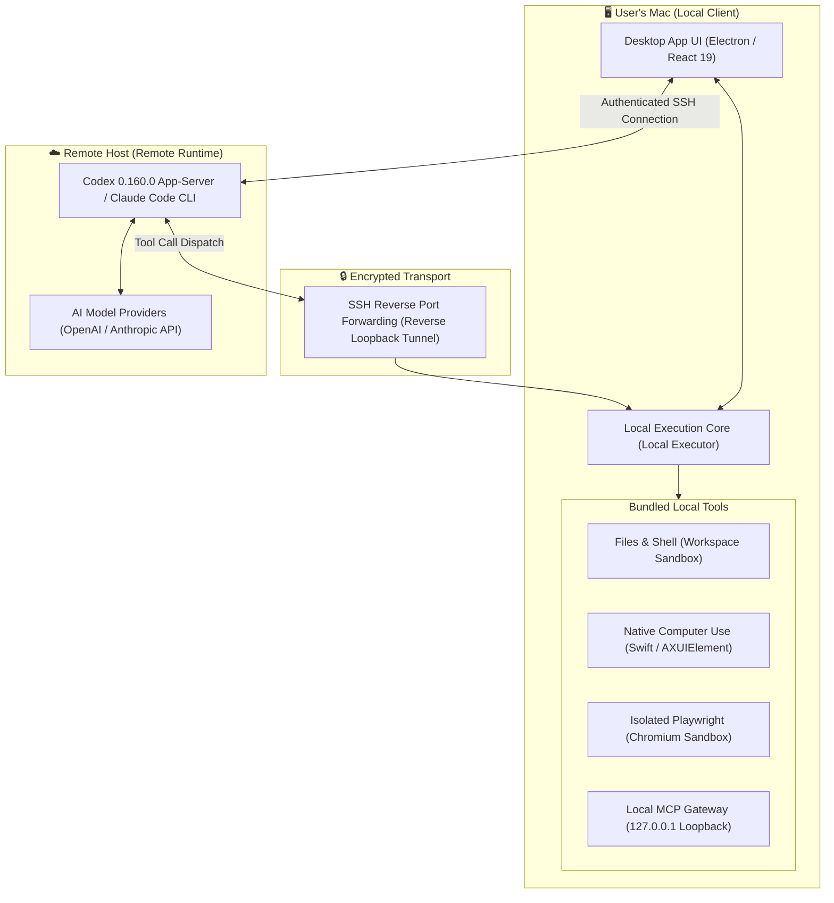

# AgentBridge Studio

[English](README_EN.md) · [繁體中文](README.md)

Chat with OpenAI Codex and Anthropic Claude Code on your Mac, empowering agents to operate files, shell commands, native applications, and browsers on **this Mac**. Model runtime execution and login credentials remain on your chosen remote host, while operational tools execute locally on your Mac.

**Version 0.4.7 · Apple Silicon · macOS 13 or later**

> **Note:** This is a remote runtime client. You do not need to install Node.js, Python, Homebrew, Codex Mac executors, Computer Use MCP servers, or browsers to get started. Initial use requires connecting to a reachable, authenticated remote runtime and granting required macOS system permissions. This application does not include free AI accounts or offline models.

---

## 🏗️ Architecture & How It Works

AgentBridge Studio employs a **Split-Execution Decoupled Architecture**: **The remote host manages model reasoning and session context, while your local Mac safely executes physical tools and system operations.**



### Core Implementation Principles

1. **Remote Reasoning with Zero Credential Leakage (Zero-Knowledge Runtime)**
   * AI logins, ChatGPT account tokens, and Anthropic API keys remain entirely on your remote server/workstation.
   * Your Mac does not store any third-party AI cloud credentials. If the remote host is disconnected or powered off, no cloud credential risks remain on the Mac.
   * SSH connection credentials on Mac are encrypted with macOS Keychain support.

2. **Secure Reverse Loopback Tunneling**
   * The app initiates a secure SSH handshake with the remote host and verifies the SSH host fingerprint to prevent Man-In-The-Middle (MITM) attacks.
   * Uses SSH Reverse Port Forwarding to securely route tool calls from the remote agent back to the local Mac.
   * Local listeners strictly bind to `127.0.0.1` (loopback only), completely preventing unauthenticated access across local networks or the internet.

3. **Zero-Dependency Bundled Native Subsystems**
   * **Native Computer Use**: Implemented in Swift (`vendor/open-codex-computer-use`), interfacing directly with macOS Accessibility APIs (`AXUIElement`) and Quartz display services for ultra-low latency screen capture, coordinate clicking, keyboard injection, and an interactive overlay cursor—without requiring external Python/Node runtimes.
   * **Isolated Browser Automation**: Ships with a version-matched Playwright Chromium build and dedicated MCP server. Uses an independent user profile, ensuring complete isolation from your personal Chrome/Safari cookies and browsing data.
   * **Path Validation**: Workspace operations enforce path-traversal safeguards and symlink protection to prevent unauthorized modifications to critical system files.

4. **System-Level Permission Boundary**
   * The in-app "Full Permission Mode" only minimizes repetitive confirmation prompts; it **cannot** bypass macOS system-level Accessibility and Screen Recording security protections.

---

## 🚀 Quick Start

You can either run directly from source using Git Clone or download the pre-packaged DMG.

### Option 1: Git Clone & Run from Source (Recommended for Developers)

Clone the repository and run the automated launcher script:

```sh
git clone https://github.com/iancheng64-cmd/AgentBridgeStudio.git
cd AgentBridgeStudio
./start.sh
```

Or using npm:

```sh
git clone https://github.com/iancheng64-cmd/AgentBridgeStudio.git
cd AgentBridgeStudio
npm install
npm start
```

> **Details**: `./start.sh` and `npm start` automatically check your environment, install dependencies, compile TypeScript & Vite bundles, and prepare the Playwright browser runtime.
> To use native macOS Computer Use (screen clicking/inspection), ensure Xcode Command Line Tools are installed (`xcode-select --install`).

### Option 2: Download Packaged DMG (No Build Required)

Go to the **[Releases](https://github.com/iancheng64-cmd/AgentBridgeStudio/releases)** page and download `AgentBridge-Studio-0.4.7-arm64.dmg`.

1. Open the DMG and drag **AgentBridge Studio** to **Applications**.
2. Launch the app from `/Applications`; do not run directly inside the DMG.
3. **If macOS displays a security prompt ("App is damaged" or "Unidentified Developer")**:
   Run this one-liner in Terminal to clear the quarantine flag:
   ```sh
   xattr -cr "/Applications/AgentBridge Studio.app"
   ```
   Or navigate to **System Settings → Privacy & Security** and click **Open Anyway**.
4. Go to **Settings → Connections & Agents**, add your remote host details (SSH host, user, port), and choose Codex or Claude Code.
5. Select a workspace folder on your Mac and connect. Verify the SSH host fingerprint on first connection.
6. Under **Computer & Tools**, check and grant macOS **Accessibility** and **Screen Recording** permissions.

For complete setup instructions, see the [Installation Guide](docs/INSTALLATION.md).

---

## 📦 What Is Bundled

| Component | Bundled in DMG / Repo |
| :--- | :--- |
| Desktop App, Electron & Node.js Runtime | Yes |
| Mac Codex CLI / Paired Executor 0.160.0 | Yes |
| Native Computer Use, CLI & Screen Overlay Helper | Yes |
| Playwright MCP, Version-Matched Chromium & FFmpeg | Yes |
| MCP Gateway & Local HTTP Transport | Yes |
| Remote Runtime Credentials, Accounts, AI Models | No (provided by your chosen remote host) |

*The bundled browser runs in an isolated sandbox and will not share login state or cookies with your everyday browser.*

---

## ☁️ Remote Host Prerequisites

- **SSH Access**: Reachable SSH server via LAN, Tailscale, or VPN.
- **Codex Host**: Must have `@openai/codex@0.160.0` installed and signed in (`npm install -g @openai/codex@0.160.0 && codex login`).
- **Claude Host**: Must have Claude Code CLI installed and signed in (`npm install -g @anthropic-ai/claude-code && claude login`).
- The remote machine must remain online while tasks are active.

---

## ⌨️ Keybindings

- `⌘ K`: Search chats
- `⇧ ⌘ N`: New conversation
- `⌘ B`: Toggle sidebar
- `⌘ ,`: Settings

---

## 🛠️ Development & Building

Developers on Apple Silicon Mac can build packages with Node.js 22 LTS, Xcode Command Line Tools, and Python 3:

```sh
npm ci
npm run setup
npm run build
npm test
npm run dist
```

For release signing, notarization, and verification pipelines, refer to [Releasing Guide](docs/RELEASING.md).

---

## 📄 License

AgentBridge Studio is open-source under the [MIT License](LICENSE). Bundled third-party components retain their respective licenses, detailed in [Third-Party Notices](THIRD_PARTY_NOTICES.md). This project is not officially affiliated with OpenAI, Anthropic, or browser vendors.
